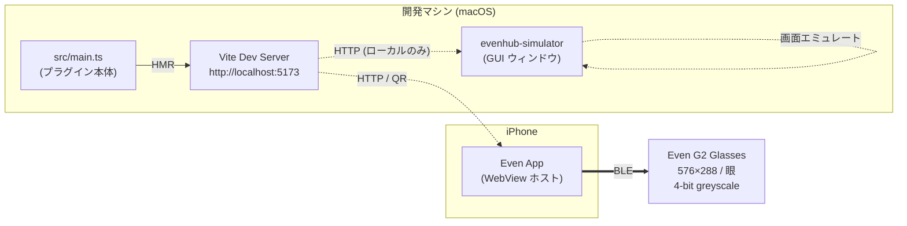
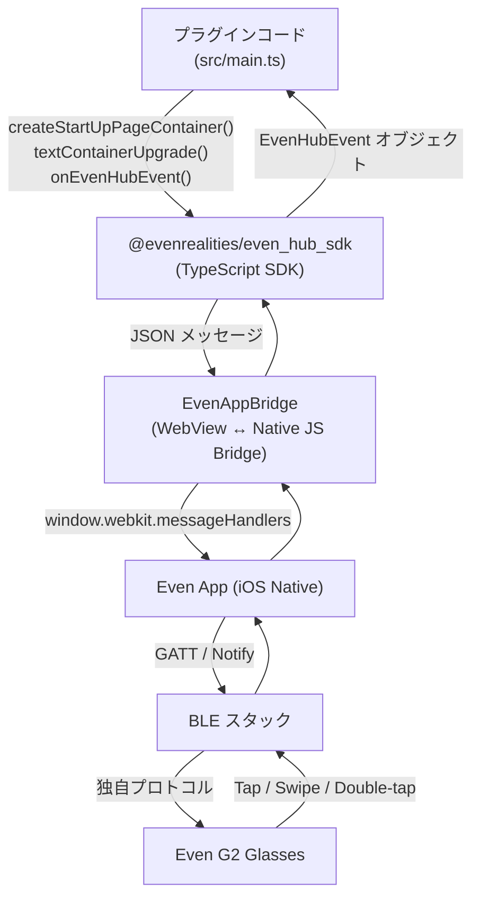
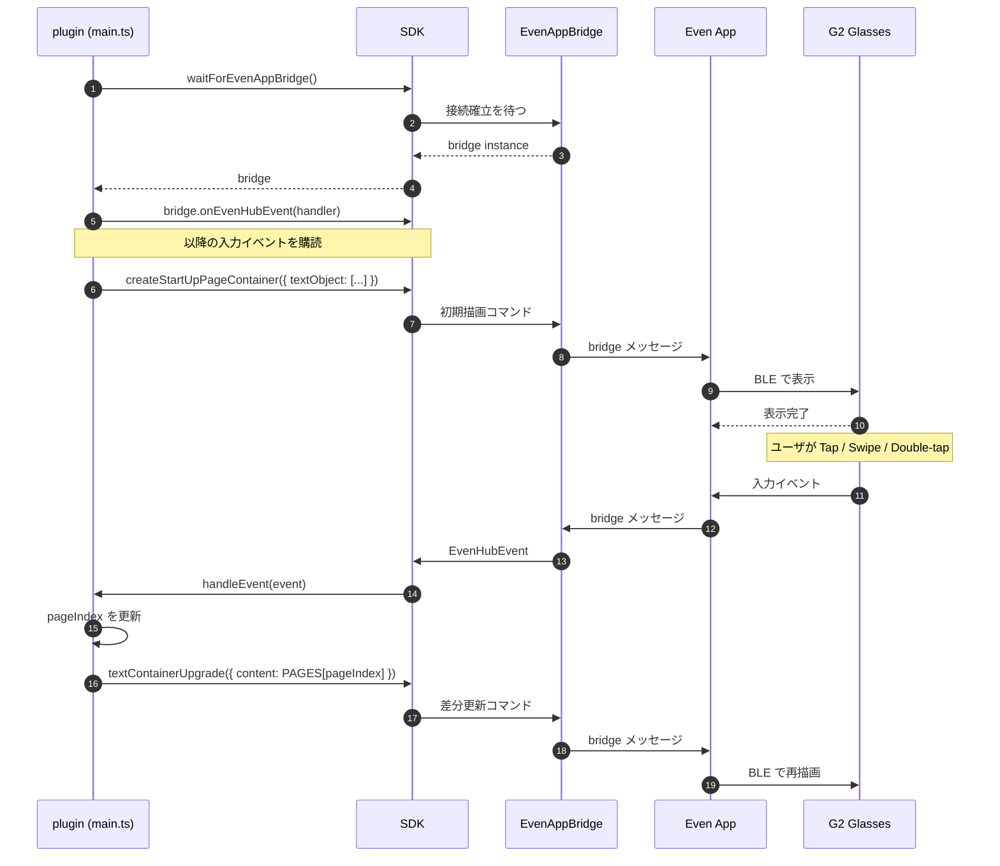
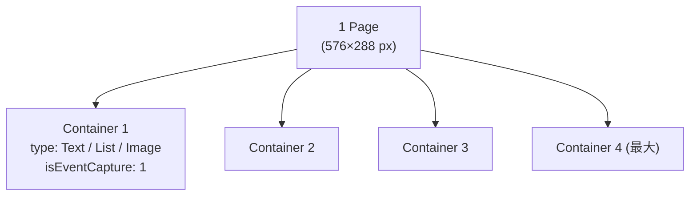
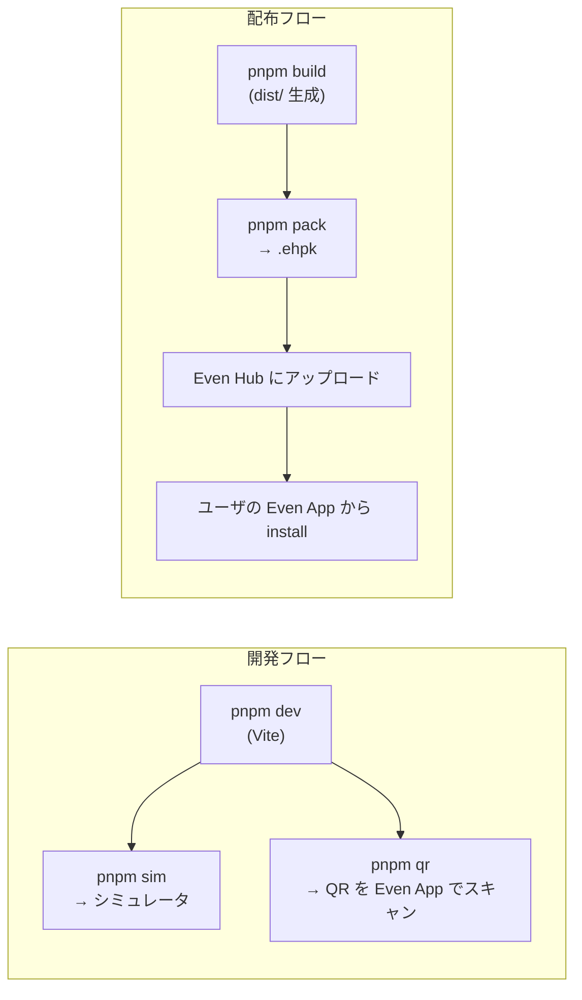
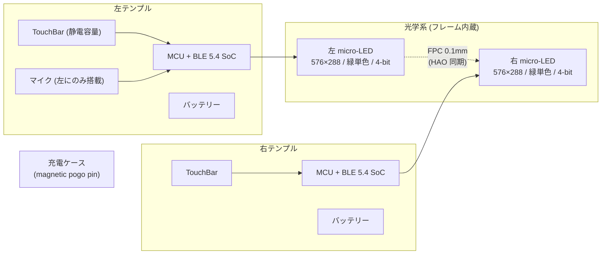
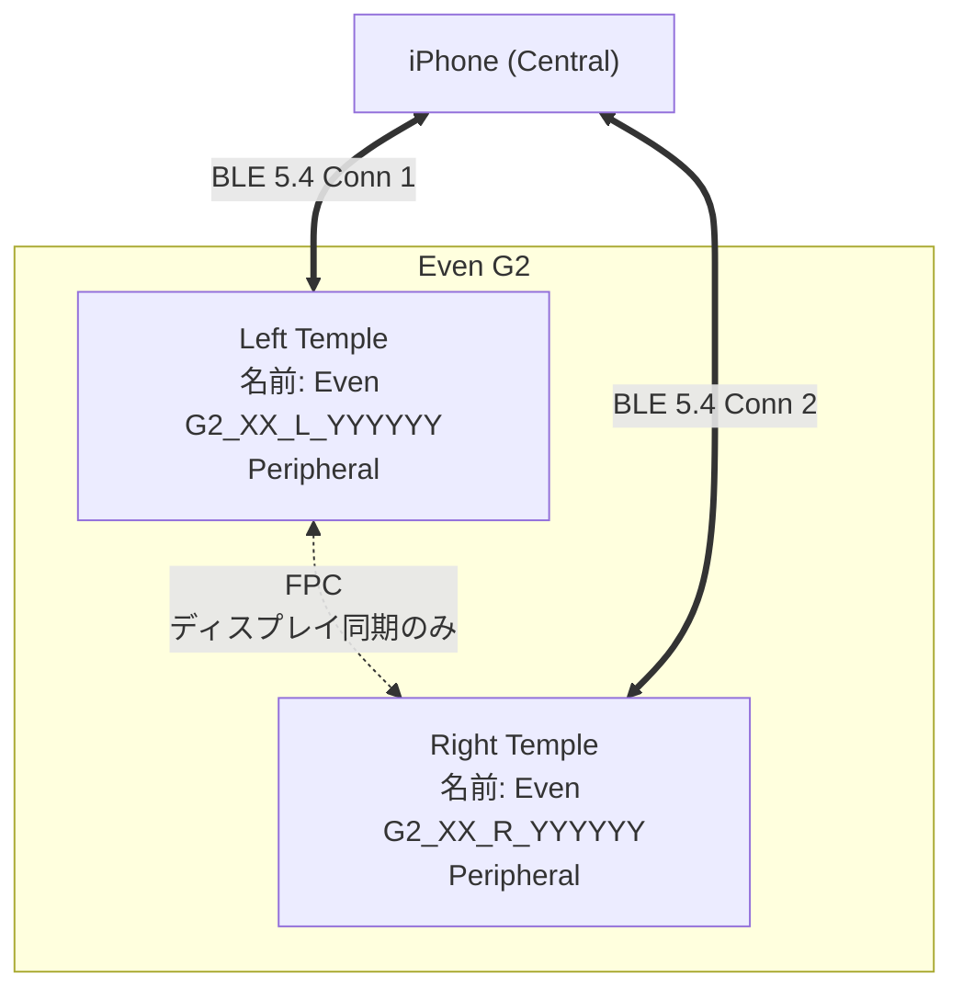
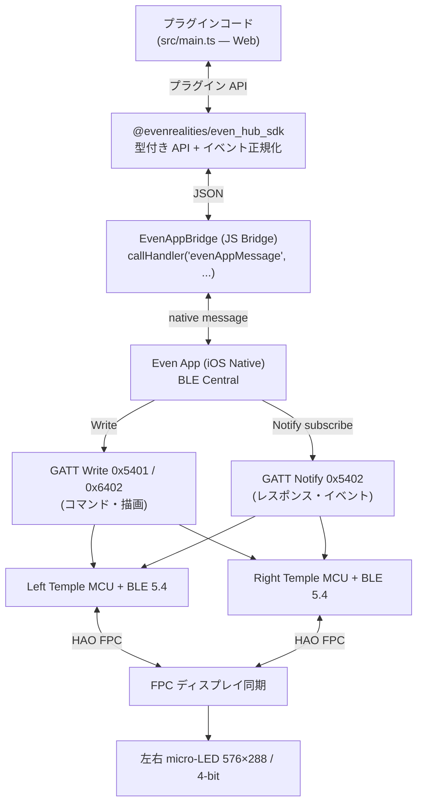

# Even G2 プラグイン集（eveng2）— 総合ガイド

[Even Realities G2](https://www.evenrealities.com/smart-glasses) スマートグラス向けのプラグイン（Web アプリ）を 2 つ収めたリポジトリです。

- **sample-app**: 貼り付けたテキストを Gemini で要約し、G2 にページめくり表示する「AI プロンプター」
- **translate-app**: マイクの英語をリアルタイムに日本語へ翻訳し、G2 に 1〜2 行表示する「ライブ翻訳」

この 1 ファイルで、**「Even G2 とは」から「アプリの作り方・使い方」、さらに「実機ハードウェア・BLE の中身」まで**を、やさしい順に解説します。

### この文書の歩き方

| 目的 | 読むところ |
|---|---|
| まず概要を知りたい | Part 1 |
| プラグインを作りたい | Part 1 → Part 2 |
| 2 つのアプリを動かしたい | Part 3 → Part 4 |
| SDK の裏側・実機の仕組みを知りたい | Part 5（上級者向け） |

- **Part 1 — 入門**: Even G2 とは / コードはどこで動くか
- **Part 2 — プラグインの作り方**: 共通の仕組み・レイヤ・実行フロー・Claude Code 活用
- **Part 3 — 2 つのアプリ**: sample-app / translate-app
- **Part 4 — 実行・配布・トラブル**: コマンド早見表 / 配布 / つまずき
- **Part 5 — 深掘り（実機 & BLE）**: ハードウェア / BLE / GATT / パケット
- **付録**: ディレクトリ構成 / 参考

---

# Part 1 — 入門

## 1. Even G2 とは

ディスプレイ付きのスマートグラスです。視界に文字を重ねて表示する HUD（ヘッドアップディスプレイ）で、次のような特徴があります。

| 項目 | 内容 |
|---|---|
| ディスプレイ | 576×288 px / 眼、4-bit greyscale（16 階調・緑単色）、**組み込みフォントのみ** |
| 入力 | テンプルの**タッチバー**、別売の R1 リング |
| センサー | **マイクあり**（左テンプル）、装着検知 |
| 非搭載 | **カメラなし・スピーカーなし**（プライバシー重視。表示と音声入力で完結） |
| 通信 | iPhone と BLE 5.4 接続（左右テンプルが別々のデバイスとして見える） |

ハードウェアの詳細（左右 micro-LED、HAO 同期、電源など）は Part 5 で解説します。

## 2. 大前提: コードはグラスでは動かない

プラグインの実体は **Web アプリ（HTML/TypeScript）** です。グラス自体は「表示と入力の端末」にすぎません。JavaScript / TypeScript はグラスでは動かず、サーバー（開発時は Vite、配布時は Even Hub）から配信され、iPhone の Even App が WebView でロードします。グラスとの通信は BLE で、Even App が中継します。

```
[あなたが書くコード(Webアプリ)]
        │ サーバー(開発時=Vite / 配布時=Even Hub)から配信
        ▼
[iPhone の Even App]  ← WebView でアプリをロード
        │ BLE で中継
        ▼
[Even G2 グラス]  ← 文字を表示し、タップ等の入力を返す
```

もう少し正確に描くと、開発マシン・iPhone・グラスの関係はこうなります。



- **コード実行場所**: WebView（iPhone）またはシミュレータ（macOS）。グラスはディスプレイ＋入力デバイス。
- **BLE 通信**: Even App が抽象化しており、プラグイン側は SDK 経由で叩くだけ。
- **シミュレータ**: iPhone を経由せず macOS 上で表示・入力イベントをエミュレート。**実機がなくても開発できます。**

---

# Part 2 — プラグインの作り方

## 3. プラグインの共通の仕組み

2 つのアプリは同じ骨組みでできています。

### 技術スタック

- **Vite + TypeScript**: Web アプリのビルド/開発サーバー
- **`@evenrealities/even_hub_sdk`**: グラスへの描画・入力イベントを扱う公式 SDK
- **`@google/genai`**: Gemini API 呼び出し（要約・翻訳）
- パッケージマネージャは **pnpm**

### SDK でやること（描画の流れ）

1. `waitForEvenAppBridge()` で iPhone(またはシミュレータ)との橋渡しを取得
2. `createStartUpPageContainer()` で初回画面（コンテナ）を作る
3. 以降の更新は `textContainerUpgrade()` で**中身だけ差し替え**（BLE 帯域が細いので全再構築しない）
4. タップ/スワイプ等は `onEvenHubEvent()` で受け取る

ハードウェア制約（SDK が課す上限）:

- 1 ページに最大 4 コンテナ。うち 1 つは必ず `isEventCapture: 1`（入力を受ける）
- テキスト上限: 初期描画 1000 文字 / 更新 2000 文字

各ファイルが薄いのは、ロジックの大半が SDK 側にあり、プラグインは**ページ定義 + 入力 → ページ遷移**だけを書けば成立するからです。

### 1 つのコードで「入力UI」と「グラス表示」を切り替える

両アプリとも、同じ `src/main.ts` を **URL クエリ `?glass` の有無**で 2 モードに分岐します。

| URL | モード | 役割 |
|---|---|---|
| `http://localhost:5173/` | ブラウザ入力 / capture | Chrome で開く。入力を受けてサーバーに送る |
| `http://localhost:5173/?glass` | glass | シミュレータ/実機が開く。グラスに描画する |

API キー（`GEMINI_API_KEY`）は **Vite の middleware（`server/api.ts`）= サーバー側でのみ**使い、ブラウザには渡しません。

### 共通の前提（初回だけ）

- Node.js **v20 以上**（SDK は v18 非対応）、pnpm
- Even Hub のグローバルツール:

```bash
pnpm add -g @evenrealities/evenhub-cli @evenrealities/evenhub-simulator
```

- Gemini API キー: シェルの `GEMINI_API_KEY` をそのまま使うか、各アプリの `.env` に記入

```bash
cp .env.example .env   # 各アプリ内で
# .env に GEMINI_API_KEY=AIza... を記入
```

## 4. レイヤ構成 — SDK が隠しているもの

プラグインのコードと物理デバイスの間には複数の抽象レイヤがあります。



| レイヤ | 役割 | 触り方 |
|---|---|---|
| プラグインコード | UI ロジックとイベントハンドラ | `src/main.ts` を書く |
| SDK | 型付き API、メッセージのシリアライズ、イベント正規化 | `import { ... } from '@evenrealities/even_hub_sdk'` |
| Bridge | WebView ↔ Native の JS Bridge。`waitForEvenAppBridge()` で取得 | SDK 内部 |
| Even App | BLE 接続、ペアリング、プロトコル変換 | Even Hub からインストール |
| BLE / Glasses | 表示と入力イベント送出 | ハードウェア |

## 5. 実行フロー — `main.ts` の流れ

`sample-app/src/main.ts` の動きを順を追って見ます。



ポイント:

- **初期化は 2 段階**: `waitForEvenAppBridge()` で Bridge を取得 → `createStartUpPageContainer()` で初回画面を作る。
- **更新は差分 API**: 全体再構築せず `textContainerUpgrade()` でコンテナの中身だけ書き換える。BLE 帯域が細いので必須。
- **イベントは 3 系統**: `textEvent` / `sysEvent` / `listEvent` に分かれる。`resolveEventType()` で正規化している。
- **CLICK_EVENT(0) の罠**: SDK が `0` を `undefined` に正規化することがあるため、`undefined` も Tap として扱う（`main.ts:69`）。

## 6. ページとコンテナのモデル

G2 はピクセル単位の描画ではなく、**コンテナ**を組み合わせて 1 ページを構成します。



制約（ハードウェア由来）:

| 項目 | 上限 / 値 |
|---|---|
| ディスプレイ | 576 × 288 px / 眼、4-bit greyscale (16 階調) |
| フォント | 組み込みフォントのみ |
| 1 ページのコンテナ数 | 最大 4 |
| イベントを受け取るコンテナ | 必ず 1 つだけ `isEventCapture: 1` |
| テキスト上限 | startup / rebuild: 1000 文字、upgrade: 2000 文字 |
| 画像サイズ | 幅 20–200 px、高さ 20–100 px |

サンプルでは 1 コンテナのみで文字列を差し替える単純構成です（`sample-app/src/main.ts`）。

## 7. Claude Code で開発を加速する（everything-evenhub プラグイン）

上の「作り方」を手で書く代わりに、**公式の Claude Code プラグイン `everything-evenhub`** を使うと、やりたいことを日本語/英語で頼むだけで、Claude が適切な手順（skill）を選んで実行してくれます。Even G2 開発の知識（SDK API・表示制約・シミュレータ・パッケージング等）を 13 個の skill にまとめた公式オープンソースです。

### 導入（Claude Code 内で実行）

```
/plugin marketplace add even-realities/everything-evenhub
/plugin install everything-evenhub@everything-evenhub
/reload-plugins
```

導入後は skill 名を覚える必要はありません。「マイク録音をトグルするボタンを付けて」「実機向けにパッケージして」のように頼めば、Claude が対応する skill を自動で呼びます。

### 入っている skill（13 個）

| skill | 何をするか |
|---|---|
| `quickstart` | Vite + TypeScript + SDK でまっさらな G2 アプリを作る初期セットアップ |
| `template` | evenhub-templates の starter から雛形を生成 |
| `sdk-reference` | `@evenrealities/even_hub_sdk` の API リファレンス |
| `cli-reference` | `evenhub` CLI（login / init / pack / qr 等）のリファレンス |
| `glasses-ui` | G2 の表示制約に沿ったコンテナ・テキスト・画像・リストの UI 構築 |
| `design-guidelines` | G2 向け表示デザインのガイドライン（読みやすさ・レイアウト） |
| `font-measurement` | 組み込みフォントの文字幅計測（折り返し・はみ出し対策） |
| `device-features` | マイク録音・IMU・デバイス情報などハードウェア機能 |
| `handle-input` | タッチパッドのジェスチャー・R1 リング入力・ライフサイクルイベント |
| `background-state` | バックグラウンド復帰時に状態を保持（`setBackgroundState` / `onBackgroundRestore`） |
| `test-with-simulator` | シミュレータでの実行とデバッグ |
| `simulator-automation` | HTTP API でスクリーンショット・入力注入・コンソールログを自動化 |
| `build-and-deploy` | パッケージング（.ehpk）と配布 |

### この 2 アプリで使える例

- translate-app を**バックグラウンド対応**に（背面に回って戻っても状態が消えない）→ `background-state`
- **実機向けにパッケージ＆配布** → `build-and-deploy`
- **タッチ操作を追加**（例: タップで録音トグル、Double Tap を終了に予約）→ `handle-input` + `device-features`
- **表示の折り返し・はみ出しを調整** → `glasses-ui` + `font-measurement`

参考リンク:

- セットアップ: https://hub.evenrealities.com/docs/AI-tooling/claude%20code/index
- Skill カタログ: https://hub.evenrealities.com/docs/AI-tooling/claude%20code/skill-catalog
- プラグイン（OSS）: https://github.com/even-realities/everything-evenhub

> このほかコミュニティ製（サードパーティ）の連携もあります（例: G2 の音声を外部エージェントへ橋渡しする `even-g2-bridge`、G2 からハンズフリーで Claude Code を操作する `claude-code-g2`）。アプリ本体を作って実機に載せる用途なら、まずは公式の `everything-evenhub` だけで十分です。

---

# Part 3 — 2 つのアプリ

## 8. sample-app（AI プロンプター）

貼り付けたテキストを Gemini で要約し、G2 に**ページめくり表示**します。登壇のカンペ、記事ブリーフィング、議事録整理などに。

### 仕組み

```
[Chrome /] テキスト貼り付け ──POST /api/summarize──> Gemini で要約(ページ配列)
                                          │
                                          ▼ SSE/polling
[シミュレータ /?glass] 1 ページずつ表示。Tap で次ページ
```

### 使い方

```bash
cd sample-app
pnpm install
pnpm rebuild esbuild   # 初回のみ

# ターミナル1
pnpm dev
# ターミナル2
pnpm sim
# Chrome で http://localhost:5173/ を開く
```

1. スタイル（要点 / 詳細 / 質問 Q&A）を選ぶ
2. テキストを貼り付けて「要約して送信」
3. シミュレータにページが流れる

グラス側の操作: Tap / Swipe↓ = 次ページ、Swipe↑ = 前ページ、Double-tap = 先頭へ。

## 9. translate-app（ライブ翻訳）

マイクで拾った**英語**をブラウザの音声認識で文字にし、Gemini で**日本語**へ翻訳して G2 に **1〜2 行**表示します。海外スピーカーを聞きながら訳文を読む用途。

### 仕組み

```
[Chrome /]  マイク → Web Speech(英語認識) → 確定英文
     │  POST /api/translate { text }
     ▼
[server/api.ts] → Gemini(gemini-3.5-flash) で日本語訳 → state 更新
     ▲ GET /api/current (1.2 秒ごとに polling)
     │
[シミュレータ /?glass] textContainerUpgrade で 1〜2 行を差し替え表示
```

ポイント: **「聞く側（capture, `/`）」と「映す側（glass, `?glass`）」が役割分担**しています。翻訳を作るのは capture 側だけで、glass 側はサーバーの最新訳を表示するだけです。

### 使い方（シミュレータで確認）

```bash
cd translate-app
pnpm install
pnpm rebuild esbuild   # 初回のみ

# ターミナル1
pnpm dev
# ターミナル2
pnpm sim
# Google Chrome で http://localhost:5173/ を開く
```

1. 「▶ 開始」を押してマイクを許可
2. 英語を話す（または英語音声を再生）
3. 区切りごとに日本語訳がシミュレータに 1〜2 行で出る

> 音声認識はブラウザ内蔵の Web Speech API を使うため **Google Chrome** で開いてください。

### 実機（iPhone + G2）で使うとき

iPhone の WebView は 1 つの URL しか開けず、iOS では音声認識も動きにくいので、役割を分けます。

1. Mac で `pnpm dev` を起動したまま
2. **Mac の Chrome** で `http://localhost:5173/` を開き「▶ 開始」 ← 聞き役
3. iPhone は `pnpm qr` の QR で `/?glass` を開く ← グラス表示役（Mac と同じ Wi-Fi、QR は Mac の LAN IP）

つまり「発表者の近くに Mac を置いて聞かせ、装着者はグラスで訳を読む」構成です。完全にスマホだけで完結させたい場合は、音声を iPhone で拾って Gemini に直送する別方式（マルチモーダル）への作り替えが必要です。

### テスト

```bash
cd translate-app
pnpm test   # 訳文整形 cleanTranslation の単体テスト（vitest）
```

設計書と実装計画: `docs/superpowers/specs/` と `docs/superpowers/plans/` を参照。

---

# Part 4 — 実行・配布・トラブル

## 10. コマンド早見表

各アプリのディレクトリ内で実行します。

| コマンド | 役割 |
|---|---|
| `pnpm install` | 依存をインストール（初回） |
| `pnpm dev` | 開発サーバー起動（必須・常駐） |
| `pnpm sim` | macOS シミュレータでグラス表示を再現 |
| `pnpm qr` | 実機 iPhone 用に QR を表示 |
| `pnpm build` | 本番ビルド（`dist/`） |
| `pnpm pack` | `.ehpk` 配布パッケージを生成 |
| `pnpm test` | テスト（translate-app のみ） |

停止は各ターミナルで `Ctrl + C`。

## 11. 開発と配布の二系統

**開発時**と**配布時**でホスティングが変わります。



- **開発時**: 自分の Mac の Vite を直接読む。HMR が効くので `main.ts` を保存するだけでシミュレータ／実機に反映。
- **配布時**: ビルド成果物を `.ehpk` にまとめて Even Hub に出す。`app.json` がマニフェスト（`package_id` / `entrypoint` など）。

> **配布時の注意（この 2 アプリ）**: `app.json` は現行の `evenhub pack` が要求する必須フィールド（`edition` / `min_app_version` / `min_sdk_version` / `permissions` / `supported_languages`）を満たすよう更新が必要です。また `/api/*`（翻訳・要約バックエンド）は Vite dev サーバー内にのみ存在するため、`.ehpk` 配布版では別途バックエンドのホスティングが必要になります。開発・デモ（`pnpm dev` + `pnpm sim`）には影響しません。

## 12. つまずきやすいポイント

| 症状 | 原因 / 対処 |
|---|---|
| `waitForEvenAppBridge()` が返らない | Vite を `--host 0.0.0.0` で起動していない／シミュレータが正しい URL を見ていない |
| Tap が反応しない | `isEventCapture: 1` のコンテナがないか複数ある |
| 文字が途中で切れる | テキスト上限（startup 1000 / upgrade 2000 字）超過 |
| 実機で QR が読めない | iPhone と Mac が同じ LAN にいない |
| `CLICK_EVENT` だけ捕まらない | SDK が `0` を `undefined` に正規化する仕様。`undefined` も Tap として扱う |
| Node 18 で動かない | SDK が v20+ 必須 |

---

# Part 5 — 深掘り: 実機ハードウェア & BLE（上級者向け）

ここまでは「プラグイン開発者の視点」でした。ここからは Even App の下、**BLE プロトコルとグラス本体**でどう動いているかを見ます。公式 SDK は意図的にこの層を隠していますが、構造を知っておくと SDK の制約の理由が腑に落ちます。

> 情報源: Even Realities 公式ブログ、コミュニティによるリバースエンジニアリング（`i-soxi/even-g2-protocol`、`nickustinov/even-g2-notes`）。詳細は末尾の参考リンク。

## 13. ハードウェア構成



| 項目 | 仕様 |
|---|---|
| ディスプレイ | デュアル micro-LED（緑単色）、576×288 px / 眼、4-bit greyscale（16 階調） |
| 同期方式 | **HAO 設計** — フレーム内に通した 0.1mm FPC で左右ディスプレイを直結（旧 G1 は無線同期） |
| 無線 | BLE 5.4 + **PAwR**（Periodic Advertising with Responses） |
| センサー | 静電タッチバー（左右テンプル）、マイク、装着検知 |
| 非搭載 | **カメラなし・スピーカーなし** |
| 入力デバイス | グラス本体の TouchBar、別売 R1 リング |
| カメラがない理由 | プライバシー重視。HUD は表示専用、音声入力で完結 |

**フォントが組み込みのみ**な理由も納得できます: 4-bit greyscale の小さい micro-LED で任意フォントを描くと帯域もメモリも足りません。G2 は「決められた形を素早く出す」設計です。

## 14. 左右グラスの BLE 接続モデル

G2 の独特なところ: **左右のテンプルは別々の BLE デバイス**として iPhone に見えます。



- iPhone は **2 本の BLE 接続**を張る（左に 1 本、右に 1 本）。アドバタイズ名で識別: `Even G2_XX_L_...` / `Even G2_XX_R_...`
- 左右の MCU は独立しており、コマンドは原則**両方に同じものを送る**（または役割で振り分け）。
- 左右の**ディスプレイ同期は無線ではなく物理 FPC**。だから「左だけ更新が遅れる」が起きない。
- G1 では「左 MCU → 右 MCU」もワイヤレスで、計 3 チャネル必要だった。G2 では FPC で 2 チャネルに減ったため、パケット衝突 50% 減・消費電力 25% 減・干渉復帰 35% 短縮（公式ブログ）。
- 接続パラメータ: Interval 7.5–30ms / Slave Latency 0 / Supervision Timeout 2000ms / MTU 512 bytes。

**ペアリングは BLE 標準のボンディングではない**。PIN もセキュアペアリングも使わず、アプリケーション層で 7 パケットのハンドシェイク（タイムスタンプ + トランザクション ID）でセッションを確立します。

## 15. BLE GATT サービスとキャラクタリスティック

各テンプルの GATT 構造（コミュニティ解析）。

| UUID | ハンドル | 種別 | 用途 |
|---|---|---|---|
| `00002760-08c2-11e1-9073-0e8ac72e0000` | — | Service | メインサービス |
| `…2e5401` | `0x0842` | Write w/o Response | コマンド送信 (Phone → Glasses) |
| `…2e5402` | `0x0844` | Notify | レスポンス受信 (Glasses → Phone) |
| `…2e6402` | `0x0864` | Write w/o Response | ディスプレイ描画（204 バイトの描画パケット） |
| `…2e5450` | — | — | Service Declaration |
| — | `0x0884` | Notify | 補助制御（用途未確定） |

ポイント:

- **コマンドとレスポンスでチャネルが分離**（5401 / 5402）。送って受けるだけの片方向ストリームを 2 本張る作り。
- **描画専用チャネル（6402）が別**にある。テキスト等の「アプリ意味」レイヤと、ピクセルに近い「描画」レイヤを分けている。
- Write はすべて **Write Without Response**（応答を待たない）。応答が必要な場合は Notify で別チャネルから返ってくる。
- Notify を受けるには CCCD に `0x0100` を書く（標準的な手順）。

## 16. パケット構造

`0x5401` に流すコマンドのバイト列。

```
┌────────┬────────┬────────┬────────┬────────┬────────┬────────┬────────┬─────────────┬────────┬────────┐
│ Magic  │  Type  │  Seq   │  Len   │ PktTot │ PktSer │ Svc Hi │ Svc Lo │   Payload   │ CRC Lo │ CRC Hi │
│  0xAA  │  0x21  │ 0..255 │  N+2   │  0x01  │  0x01  │        │        │  protobuf   │        │        │
└────────┴────────┴────────┴────────┴────────┴────────┴────────┴────────┴─────────────┴────────┴────────┘
  [0]      [1]      [2]      [3]      [4]      [5]      [6]      [7]       [8..N-3]     [N-2]    [N-1]
```

| Byte | 役割 |
|---|---|
| `0xAA` | Magic（固定） |
| `0x21` / `0x12` | Type — `0x21` Command (Phone → Glasses) / `0x12` Response (Glasses → Phone) |
| Seq | 送信側ごとに 0..255 でインクリメント |
| Len | Payload + CRC のバイト数 |
| PktTot / PktSer | 分割送信時の総数 / 通番（512 バイト MTU を超える場合に使う） |
| Svc Hi / Svc Lo | サービス ID（後述） |
| Payload | サービスごとに protobuf エンコード |
| CRC | **CRC-16/CCITT**（Init `0xFFFF` / Poly `0x1021`）、**Payload のみ**を対象（ヘッダ 8 バイトは含まない）、Little-endian |

サービス ID 例:

| Service | 用途 |
|---|---|
| `0x80-00` / `0x80-20` / `0x80-01` | 認証・セッション管理・時刻同期 |
| `0x04-20` | Display Wake |
| `0x06-20` | Teleprompter（テキスト表示・スクリプト） |
| `0x07-20` | Dashboard（ウィジェット） |
| `0x09-00` | Device Info（バージョン、ファームウェア） |
| `0x0B-20` / `0x11-20` | Conversate（音声書き起こし） |
| `0x0C-20` | Tasks |
| `0x0D-00` | Configuration |
| `0x0E-20` | Display Config |
| `0x20-20` | Commit |
| `0x81-20` | Display Trigger |

サービス ID の low byte は慣習的に `0x00`=Control/Query, `0x01`=Response, `0x20`=Data Payload を表します。

## 17. プラグインから物理ビットまでの全スタック

Part 2 のレイヤ図と合体させると、最終的にこうなります。



**SDK が隠しているもの:**

1. 左右 2 接続の管理（同じコマンドを両方に送る or 役割で振り分け）
2. パケットのヘッダ組み立て・CRC 計算・分割送信
3. Service ID と protobuf スキーマの対応付け
4. セッションハンドシェイク・時刻同期・ハートビート
5. Notify ストリームからのイベント復元・正規化（Part 2 の `CLICK_EVENT(0) → undefined` 罠もここ起因）

逆に言えば、プラグイン側から「左だけ」や「描画チャネル直接叩き」はできません。**公式 SDK は意図的に Teleprompter / Dashboard 等の「アプリ意味レイヤ」だけを公開**しています。低レベルを触りたい場合は SDK を介さず自前 BLE スタックを書くしかありません（= リバースエンジニアリングの世界）。

## 18. レイヤ別の責務マッピング

| レイヤ | 誰が書く | 何を扱う | 失敗時の症状 |
|---|---|---|---|
| プラグインコード | あなた | ページ定義・イベント処理 | UI が出ない |
| Hub SDK | Even Realities | API 型・イベント正規化 | SDK 更新で API 名変わる |
| EvenAppBridge | Even App (iOS) | WebView ↔ Native | `waitForEvenAppBridge()` 返らない |
| BLE Central | Even App (iOS) | GATT 接続・パケット組立 | 左右どちらか切断 |
| BLE Peripheral | グラス FW | コマンド解釈・描画依頼 | 表示が崩れる・遅延 |
| HAO FPC | ハードウェア | 左右ディスプレイ同期 | 左右ズレ（G1 で起きた問題） |
| micro-LED | ハードウェア | 実ピクセル | フォント・色の制約 |

プラグイン開発で起きる不具合の大半は上の 3 層に閉じます。SDK の制約（コンテナ最大 4 / テキスト上限 1000–2000 字 / 4-bit greyscale）は、すべて下のハードウェア層の事情から逆算されています。

---

# 付録

## 19. ディレクトリ構成

```
eveng2/
├── README.md            # 本ドキュメント（入門〜実機/BLE の総合ガイド）
├── docs/
│   ├── images/          # 図・イメージ（アプリ仕組み図など）
│   ├── superpowers/     # 設計書 specs/ ・実装計画 plans/
│   └── ...              # スライド(pptx) 等の資料
├── sample-app/          # AI プロンプター
└── translate-app/       # ライブ翻訳
    ├── src/main.ts        # ?glass で capture/glass に分岐
    ├── server/api.ts      # /api/translate, /api/current（Gemini 呼び出し）
    ├── server/clean.ts    # 訳文整形（テスト付き）
    ├── vite.config.ts     # middleware 注入
    ├── app.json           # Even Hub マニフェスト
    └── index.html
```

## 20. 参考

**公式**

- Even Hub Docs: https://hub.evenrealities.com/docs
- 公式ブログ「How We Rebuilt G2 From the Inside Out」: https://www.evenrealities.com/blog/how-we-rebuilt-g2-from-the-inside-out
- SDK npm: https://www.npmjs.com/package/@evenrealities/even_hub_sdk
- everything-evenhub（Claude Code skill 集・公式 OSS）: https://github.com/even-realities/everything-evenhub

**コミュニティ / 解析**

- コミュニティ docs（プラグイン視点）: https://github.com/nickustinov/even-g2-notes
- BLE プロトコル リバースエンジニアリング（実機視点）: https://github.com/i-soxi/even-g2-protocol
- 元にしたテンプレ: https://github.com/brianmatzelle/even-realities-g2-glasses
