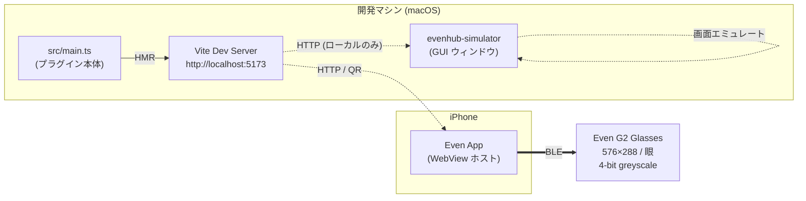
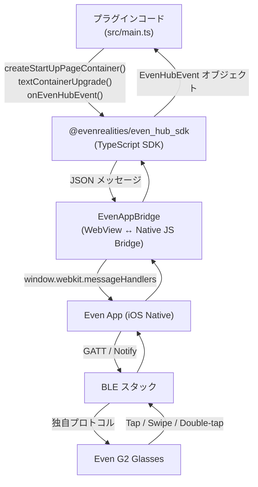
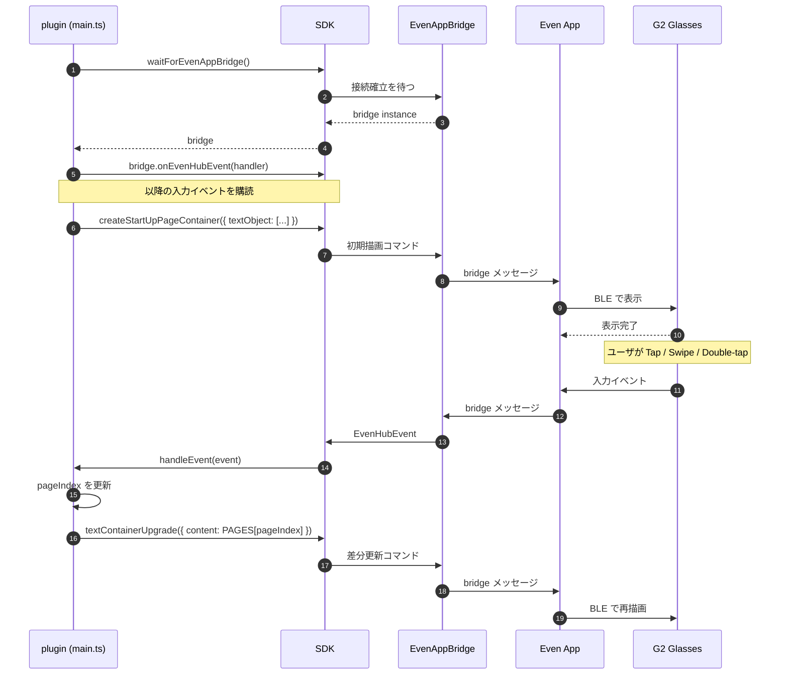
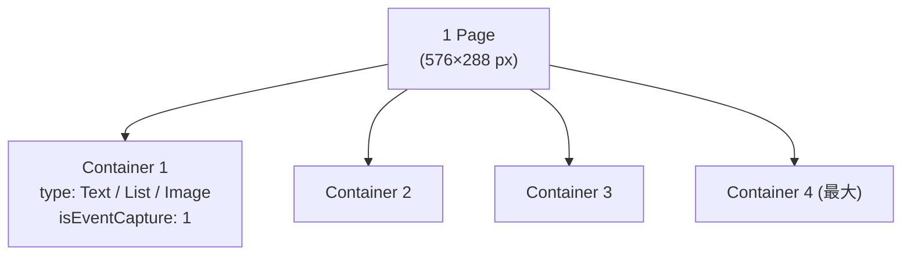
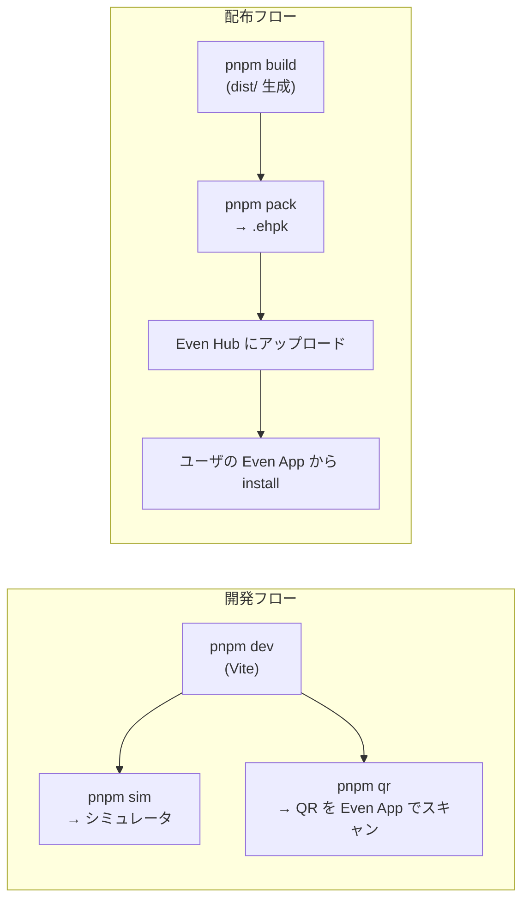
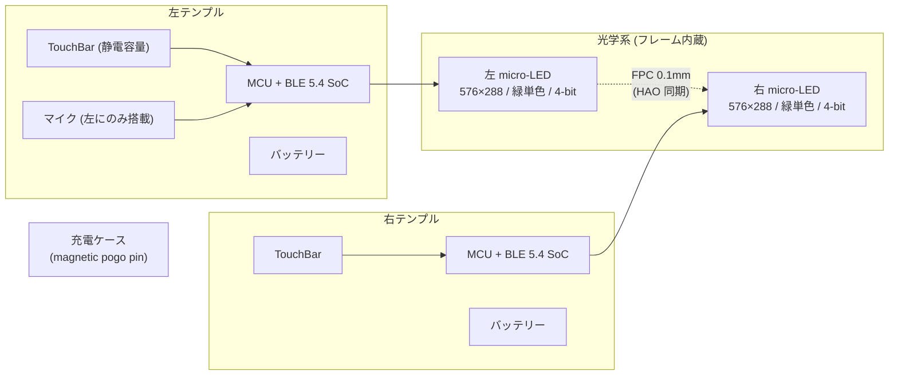
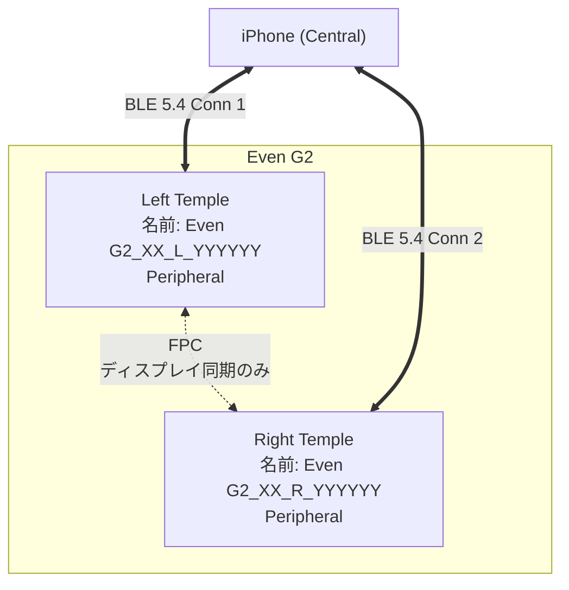
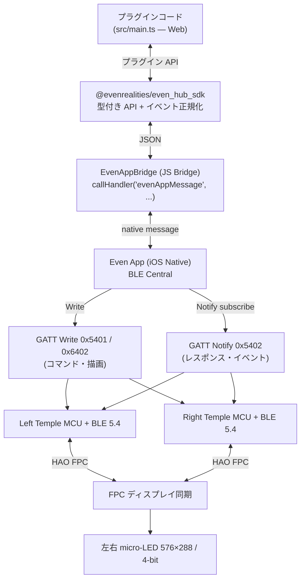

# Even G2 アーキテクチャ解説

[Even Realities G2](https://www.evenrealities.com/smart-glasses) スマートグラス向けプラグインがどう動くかを、図とともに整理する。

このリポジトリの `sample-app/` は最小サンプルだが、ここで触れる構造は Even G2 プラグイン全般に共通する。

---

## 1. 全体像 — どこでコードが走るか

**重要な前提:** プラグインの JavaScript / TypeScript はグラスでは動かない。Web アプリとしてサーバー（開発時は Vite、配布時は Even Hub）から配信され、iPhone の Even App が WebView でロードする。グラスとの通信は BLE で、Even App が中継する。



- **コード実行場所**: WebView（iPhone）またはシミュレータ（macOS）。グラスはディスプレイ＋入力デバイス。
- **BLE 通信**: Even App が抽象化しており、プラグイン側は SDK 経由で叩くだけ。
- **シミュレータ**: iPhone を経由せず macOS 上で表示・入力イベントをエミュレート。実機がなくても開発できる。

---

## 2. レイヤ構成 — SDK が隠しているもの

プラグインのコードと物理デバイスの間には複数の抽象レイヤがある。



| レイヤ | 役割 | 触り方 |
|---|---|---|
| プラグインコード | UI ロジックとイベントハンドラ | `src/main.ts` を書く |
| SDK | 型付き API、メッセージのシリアライズ、イベント正規化 | `import { ... } from '@evenrealities/even_hub_sdk'` |
| Bridge | WebView ↔ Native の JS Bridge。`waitForEvenAppBridge()` で取得 | SDK 内部 |
| Even App | BLE 接続、ペアリング、プロトコル変換 | Even Hub からインストール |
| BLE / Glasses | 表示と入力イベント送出 | ハードウェア |

---

## 3. 実行フロー — `main.ts` の流れ

`sample-app/src/main.ts` の動きを順を追って見る。



ポイント:

- **初期化は 2 段階**: `waitForEvenAppBridge()` で Bridge を取得 → `createStartUpPageContainer()` で初回画面を作る。
- **更新は差分 API**: 全体再構築せず `textContainerUpgrade()` でコンテナの中身だけ書き換える。BLE 帯域が細いので必須。
- **イベントは 3 系統**: `textEvent` / `sysEvent` / `listEvent` に分かれる。`resolveEventType()` で正規化している。
- **CLICK_EVENT(0) の罠**: SDK が `0` を `undefined` に正規化することがあるため、`undefined` も Tap として扱う（`main.ts:69`）。

---

## 4. ページとコンテナのモデル

G2 はピクセル単位の描画ではなく、**コンテナ**を組み合わせて 1 ページを構成する。



制約（ハードウェア由来）:

| 項目 | 上限 / 値 |
|---|---|
| ディスプレイ | 576 × 288 px / 眼、4-bit greyscale (16 階調) |
| フォント | 組み込みフォントのみ |
| 1 ページのコンテナ数 | 最大 4 |
| イベントを受け取るコンテナ | 必ず 1 つだけ `isEventCapture: 1` |
| テキスト上限 | startup / rebuild: 1000 文字、upgrade: 2000 文字 |
| 画像サイズ | 幅 20–200 px、高さ 20–100 px |

サンプルでは 1 コンテナのみで文字列を差し替える単純構成（`main.ts:24-46`）。

---

## 5. 開発フローと配布の二系統

**開発時**と**配布時**でホスティングが変わる。



- **開発時**: 自分の Mac の Vite を直接読む。HMR が効くので `main.ts` を保存するだけでシミュレータ／実機に反映。
- **配布時**: ビルド成果物を `.ehpk` にまとめて Even Hub に出す。`app.json` がマニフェスト（`package_id` / `entrypoint` など）。

---

## 6. ファイル構成と責務

```
99-eveng2/
├── architecture.md         # 本ドキュメント
├── docs/                   # 資料（pptx、ビルド補助スクリプト）
└── sample-app/
    ├── src/main.ts         # プラグイン本体。SDK 呼び出しとイベント処理
    ├── index.html          # WebView エントリ。main.ts をロードするだけ
    ├── app.json            # Even Hub マニフェスト
    ├── vite.config.ts      # dev サーバ設定（host: true で LAN 公開）
    ├── package.json        # scripts: dev / build / sim / qr / pack
    └── tsconfig.json
```

各ファイルが薄いのは、ロジックの大半が SDK 側にあり、プラグインは**ページ定義 + 入力 → ページ遷移**だけを書けば成立するから。

---

## 7. つまずきやすいポイント

| 症状 | 原因 / 対処 |
|---|---|
| `waitForEvenAppBridge()` が返らない | Vite を `--host 0.0.0.0` で起動していない／シミュレータが正しい URL を見ていない |
| Tap が反応しない | `isEventCapture: 1` のコンテナがないか複数ある |
| 文字が途中で切れる | テキスト上限（startup 1000 / upgrade 2000 字）超過 |
| 実機で QR が読めない | iPhone と Mac が同じ LAN にいない |
| `CLICK_EVENT` だけ捕まらない | SDK が `0` を `undefined` に正規化する仕様。`undefined` も Tap として扱う |
| Node 18 で動かない | SDK が v20+ 必須 |

---

---

# 第 2 部 — 実機（G2 ハードウェア & BLE）側のアーキテクチャ

ここまでは「プラグイン開発者の視点」だった。ここからは Even App の下、**BLE プロトコルとグラス本体**でどう動いているかを見る。公式 SDK は意図的にこの層を隠しているが、構造を知っておくと SDK の制約の理由が腑に落ちる。

> 情報源: Even Realities 公式ブログ、コミュニティリバースエンジニアリング（`i-soxi/even-g2-protocol`、`nickustinov/even-g2-notes`）。詳細は本ドキュメント末尾の参考リンク。

---

## 8. ハードウェア構成



| 項目 | 仕様 |
|---|---|
| ディスプレイ | デュアル micro-LED（緑単色）、576×288 px / 眼、4-bit greyscale（16 階調） |
| 同期方式 | **HAO 設計** — フレーム内に通した 0.1mm FPC で左右ディスプレイを直結（旧 G1 は無線同期） |
| 無線 | BLE 5.4 + **PAwR**（Periodic Advertising with Responses） |
| センサー | 静電タッチバー（左右テンプル）、マイク、装着検知 |
| 非搭載 | **カメラなし・スピーカーなし** |
| 入力デバイス | グラス本体の TouchBar、別売 R1 リング |
| カメラがない理由 | プライバシー重視。HUD は表示専用、音声入力で完結 |

**フォントが組み込みのみ**な理由も納得できる: 4-bit greyscale の小さい micro-LED で任意フォントを描くと帯域もメモリも足りない。G2 は「決められた形を素早く出す」設計。

---

## 9. 左右グラスの BLE 接続モデル

ここが G2 の独特なところ: **左右のテンプルは別々の BLE デバイス**として iPhone に見える。



- iPhone は **2 本の BLE 接続**を張る（左に 1 本、右に 1 本）。アドバタイズ名で識別: `Even G2_XX_L_...` / `Even G2_XX_R_...`
- 左右の MCU は独立しており、コマンドは原則**両方に同じものを送る**（または役割で振り分け）。
- 左右の**ディスプレイ同期は無線ではなく物理 FPC**。だから「左だけ更新が遅れる」が起きない。
- G1 では「左 MCU → 右 MCU」もワイヤレスで、計 3 チャネル必要だった。G2 では FPC で 2 チャネルに減ったため、パケット衝突 50% 減・消費電力 25% 減・干渉復帰 35% 短縮（公式ブログ）。
- 接続パラメータ: Interval 7.5–30ms / Slave Latency 0 / Supervision Timeout 2000ms / MTU 512 bytes。

**ペアリングは BLE 標準のボンディングではない**。PIN もセキュアペアリングも使わず、アプリケーション層で 7 パケットのハンドシェイク（タイムスタンプ + トランザクション ID）でセッションを確立する。

---

## 10. BLE GATT サービスとキャラクタリスティック

各テンプルの GATT 構造（コミュニティ解析）。

| UUID | ハンドル | 種別 | 用途 |
|---|---|---|---|
| `00002760-08c2-11e1-9073-0e8ac72e0000` | — | Service | メインサービス |
| `…2e5401` | `0x0842` | Write w/o Response | コマンド送信 (Phone → Glasses) |
| `…2e5402` | `0x0844` | Notify | レスポンス受信 (Glasses → Phone) |
| `…2e6402` | `0x0864` | Write w/o Response | ディスプレイ描画（204 バイトの描画パケット） |
| `…2e5450` | — | — | Service Declaration |
| — | `0x0884` | Notify | 補助制御（用途未確定） |

ポイント:

- **コマンドとレスポンスでチャネルが分離**（5401 / 5402）。送って受けるだけの片方向ストリームを 2 本張る作り。
- **描画専用チャネル（6402）が別**にある。テキスト等の「アプリ意味」レイヤと、ピクセルに近い「描画」レイヤを分けている。
- Write はすべて **Write Without Response**（応答を待たない）。応答が必要な場合は Notify で別チャネルから返ってくる。
- Notify を受けるには CCCD に `0x0100` を書く（標準的な手順）。

---

## 11. パケット構造

`0x5401` に流すコマンドのバイト列。

```
┌────────┬────────┬────────┬────────┬────────┬────────┬────────┬────────┬─────────────┬────────┬────────┐
│ Magic  │  Type  │  Seq   │  Len   │ PktTot │ PktSer │ Svc Hi │ Svc Lo │   Payload   │ CRC Lo │ CRC Hi │
│  0xAA  │  0x21  │ 0..255 │  N+2   │  0x01  │  0x01  │        │        │  protobuf   │        │        │
└────────┴────────┴────────┴────────┴────────┴────────┴────────┴────────┴─────────────┴────────┴────────┘
  [0]      [1]      [2]      [3]      [4]      [5]      [6]      [7]       [8..N-3]     [N-2]    [N-1]
```

| Byte | 役割 |
|---|---|
| `0xAA` | Magic（固定） |
| `0x21` / `0x12` | Type — `0x21` Command (Phone → Glasses) / `0x12` Response (Glasses → Phone) |
| Seq | 送信側ごとに 0..255 でインクリメント |
| Len | Payload + CRC のバイト数 |
| PktTot / PktSer | 分割送信時の総数 / 通番（512 バイト MTU を超える場合に使う） |
| Svc Hi / Svc Lo | サービス ID（後述） |
| Payload | サービスごとに protobuf エンコード |
| CRC | **CRC-16/CCITT**（Init `0xFFFF` / Poly `0x1021`）、**Payload のみ**を対象（ヘッダ 8 バイトは含まない）、Little-endian |

サービス ID 例:

| Service | 用途 |
|---|---|
| `0x80-00` / `0x80-20` / `0x80-01` | 認証・セッション管理・時刻同期 |
| `0x04-20` | Display Wake |
| `0x06-20` | Teleprompter（テキスト表示・スクリプト） |
| `0x07-20` | Dashboard（ウィジェット） |
| `0x09-00` | Device Info（バージョン、ファームウェア） |
| `0x0B-20` / `0x11-20` | Conversate（音声書き起こし） |
| `0x0C-20` | Tasks |
| `0x0D-00` | Configuration |
| `0x0E-20` | Display Config |
| `0x20-20` | Commit |
| `0x81-20` | Display Trigger |

サービス ID の low byte は慣習的に `0x00`=Control/Query, `0x01`=Response, `0x20`=Data Payload を表す。

---

## 12. プラグインから物理ビットまでの全スタック

第 1 部の図と合体させると、最終的にこうなる。



**SDK が隠しているもの:**

1. 左右 2 接続の管理（同じコマンドを両方に送る or 役割で振り分け）
2. パケットのヘッダ組み立て・CRC 計算・分割送信
3. Service ID と protobuf スキーマの対応付け
4. セッションハンドシェイク・時刻同期・ハートビート
5. Notify ストリームからのイベント復元・正規化（第 1 部の `CLICK_EVENT(0) → undefined` 罠もここ起因）

逆に言えば、プラグイン側から「左だけ」や「描画チャネル直接叩き」はできない。**公式 SDK は意図的に Teleprompter / Dashboard 等の「アプリ意味レイヤ」だけを公開**している。低レベルを触りたい場合は SDK を介さず自前 BLE スタックを書くしかない（= リバースエンジニアリングプロジェクトの世界）。

---

## 13. 第 1 部と第 2 部の責務マッピング

| レイヤ | 誰が書く | 何を扱う | 失敗時の症状 |
|---|---|---|---|
| プラグインコード | あなた | ページ定義・イベント処理 | UI が出ない |
| Hub SDK | Even Realities | API 型・イベント正規化 | SDK 更新で API 名変わる |
| EvenAppBridge | Even App (iOS) | WebView ↔ Native | `waitForEvenAppBridge()` 返らない |
| BLE Central | Even App (iOS) | GATT 接続・パケット組立 | 左右どちらか切断 |
| BLE Peripheral | グラス FW | コマンド解釈・描画依頼 | 表示が崩れる・遅延 |
| HAO FPC | ハードウェア | 左右ディスプレイ同期 | 左右ズレ（G1 で起きた問題） |
| micro-LED | ハードウェア | 実ピクセル | フォント・色の制約 |

プラグイン開発で起きる不具合の大半は上の 3 層に閉じる。SDK の制約（コンテナ最大 4 / テキスト上限 1000–2000 字 / 4-bit greyscale）は、すべて下のハードウェア層の事情から逆算されている。

---

## 参考

- 公式 Even Hub Docs: https://hub.evenrealities.com/docs
- 公式ブログ「How We Rebuilt G2 From the Inside Out」: https://www.evenrealities.com/blog/how-we-rebuilt-g2-from-the-inside-out
- SDK npm: https://www.npmjs.com/package/@evenrealities/even_hub_sdk
- コミュニティ docs（プラグイン視点）: https://github.com/nickustinov/even-g2-notes
- BLE プロトコル リバースエンジニアリング（実機視点）: https://github.com/i-soxi/even-g2-protocol
- 元テンプレ: https://github.com/brianmatzelle/even-realities-g2-glasses
